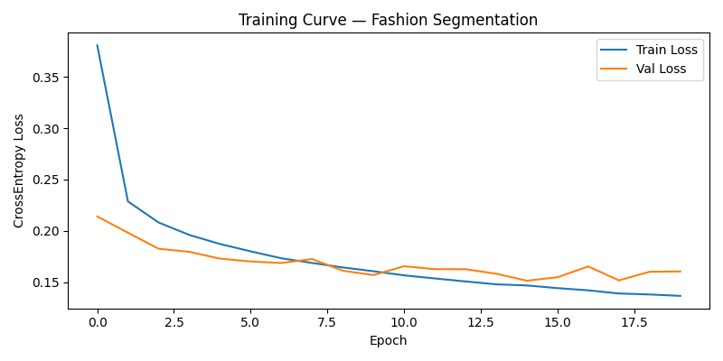
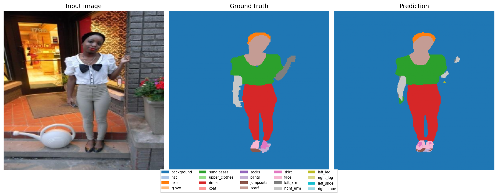
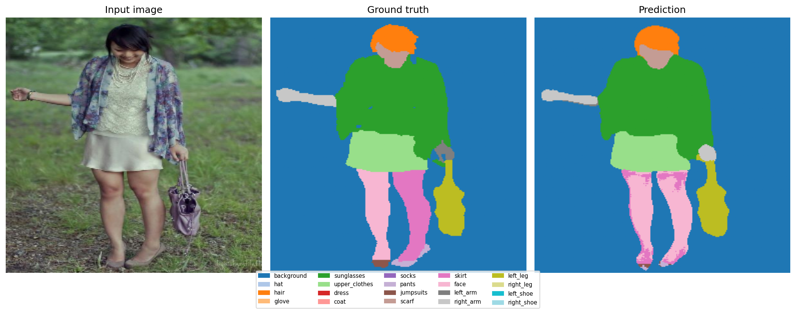
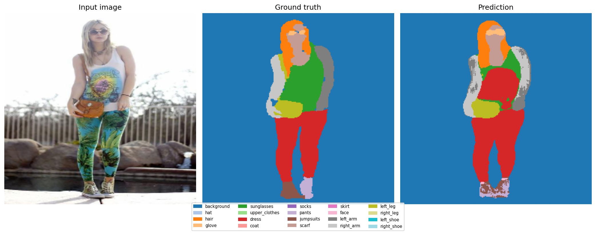
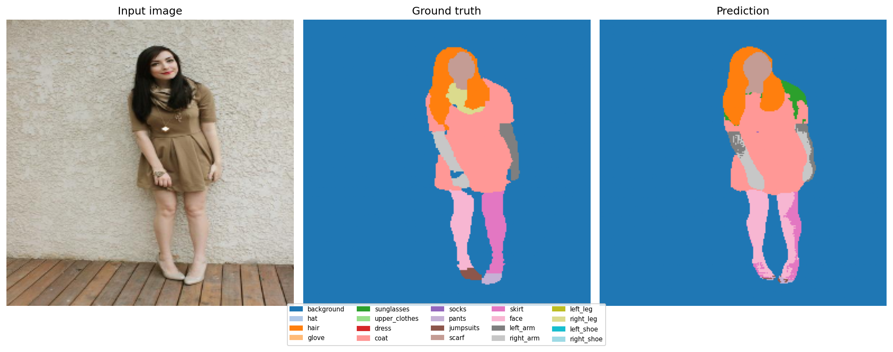
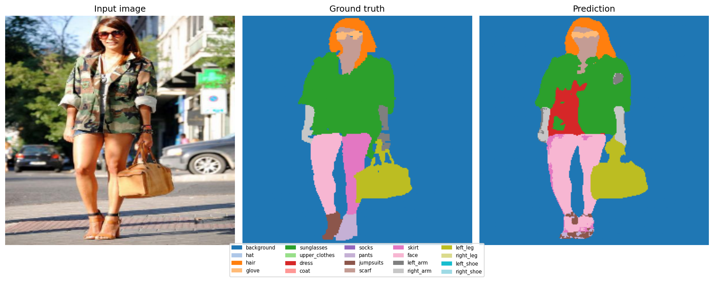
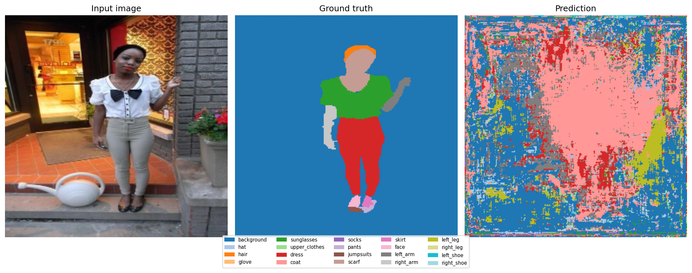
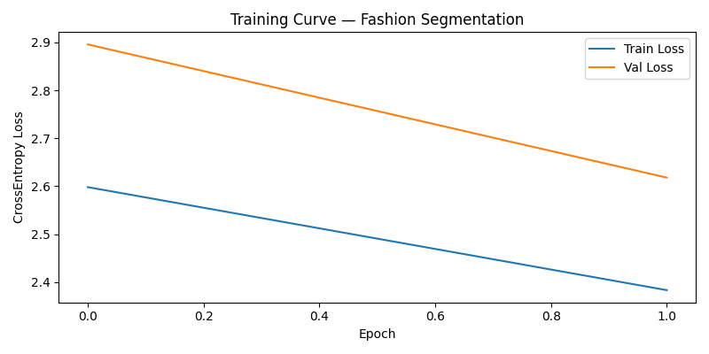

# Fashion / Human Parsing Segmentation

A semantic segmentation model that parses a photo of a person into 20 pixel-level
classes (background, hair, upper clothes, dress, pants, arms, legs, shoes, etc.),
trained with a U-Net decoder over a ResNet encoder.



## Results

Trained on 16,706 images, with 500 held out for validation and 500 for final testing
(all drawn from the human parsing dataset). Metrics below are from the held-out test set:

| Metric | Value |
|---|---|
| Pixel Accuracy | **93.94%** |
| Mean IoU | **0.5445** |
| Mean Dice | **0.6774** |
| Zero-IoU Rate | 3.63% (class present, never predicted) |
| False-Positive Rate | 8.10% (class predicted, absent in ground truth) |

Best-performing classes (IoU): `background` (0.98), `scarf` (0.81), `sunglasses` (0.78),
`hair` (0.77). Hardest classes: `pants` (0.23), `left_arm` (0.20), `skirt` (0.26) —
likely due to visual overlap with similar classes (e.g. pants vs. jumpsuits, arms vs. sleeves)
and class imbalance in the training data.

Full per-class breakdown and training log: [`training_log_resnet50.txt`](training_log_resnet50.txt)

### Sample predictions

Each row shows: input image → ground truth mask → model prediction.







## Development process

My first full training run (20 epochs) plateaued near the random-guess baseline for
20 classes (loss ~2.6–2.9, vs. a theoretical random baseline of ~3.0) — predictions
were essentially noise:




After debugging the pipeline, I retrained and got the results below — a large jump
in both loss and prediction quality.

## Model

- **Architecture:** U-Net (via [segmentation-models-pytorch](https://github.com/qubvel/segmentation_models.pytorch))
- **Encoder:** ResNet50, ImageNet-pretrained
- **Input size:** 256×256
- **Loss:** Cross-entropy (pixel-wise, ignore_index=255)
- **Optimizer:** Adam, lr=1e-4, `ReduceLROnPlateau` scheduler
- **Augmentation:** horizontal flip, brightness/contrast jitter, shift/scale/rotate (via Albumentations)
- **Classes (20):** background, hat, hair, glove, sunglasses, upper_clothes, dress, coat,
  socks, pants, jumpsuits, scarf, skirt, face, left_arm, right_arm, left_leg, right_leg,
  left_shoe, right_shoe

Trained for 20 epochs with early stopping on validation loss (patience=15).

## Repo structure

```
fashion-segmentation/
├── src/
│   ├── fashion_combined.py      # dataset, transforms, model, training loop
│   ├── fashion_eval.py          # loads a checkpoint and runs evaluation
│   └── fashion_eval_metrics.py  # pixel accuracy / IoU / Dice metrics
├── results/                     # training curve + sample predictions
├── training_log_resnet50.txt    # full training + evaluation log
└── README.md
```

## Usage

Expects data in the following layout:

```
dataset/
├── Train/
│   ├── images/
│   └── masks/
├── Valid/
│   ├── images/
│   └── masks/
└── Test/
    ├── images/
    └── masks/
```

Train:
```bash
python src/fashion_combined.py
```

Evaluate a checkpoint:
```bash
python src/fashion_eval.py
```

## Model weights

The trained checkpoint (`fashion_seg_best.pth`, ~125 MB) is not included in this repo.

## Requirements

```
torch
segmentation-models-pytorch
albumentations
numpy
matplotlib
Pillow
```
